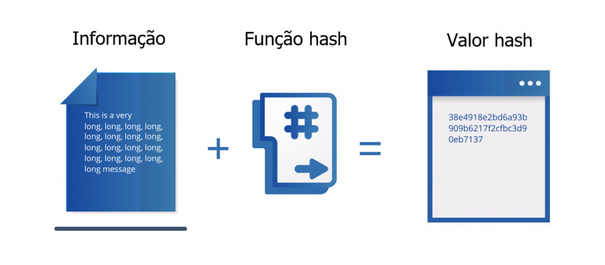
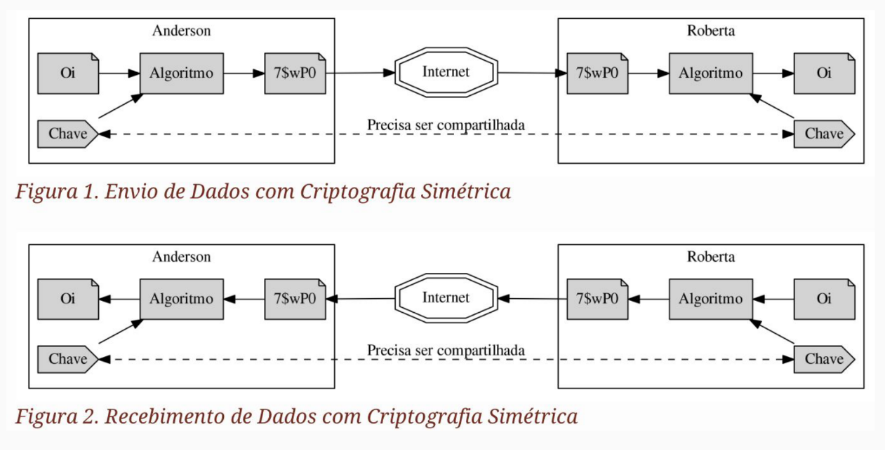
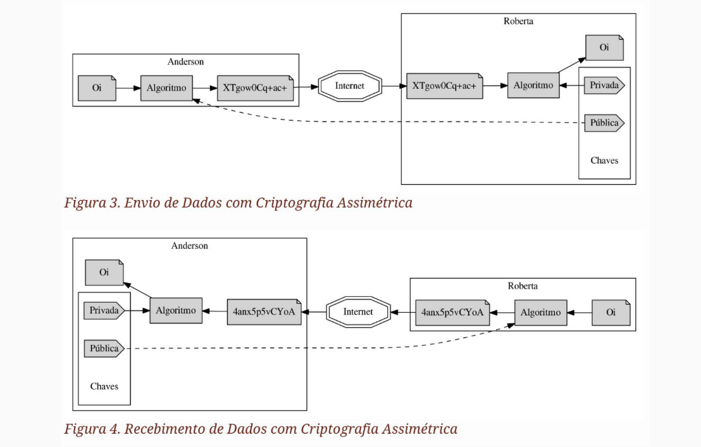
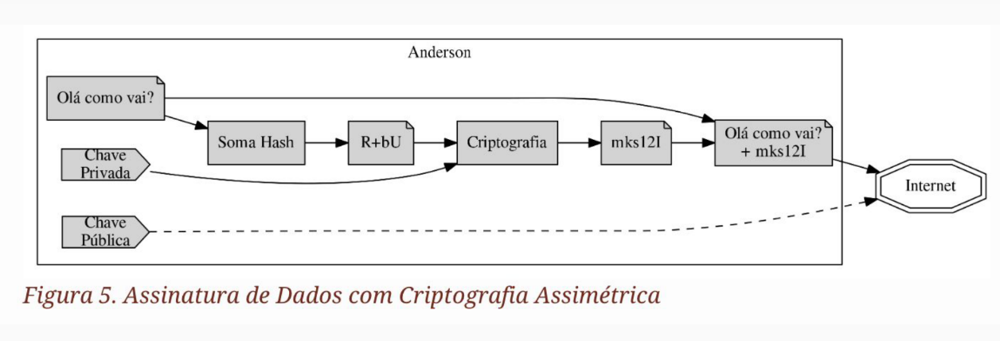
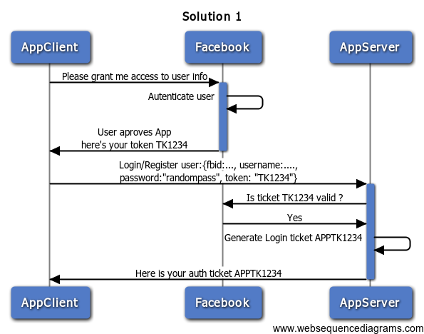
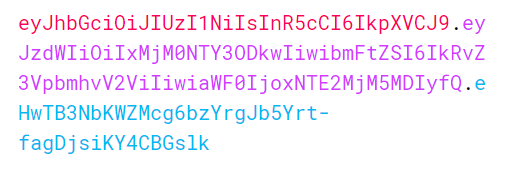
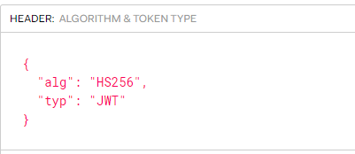
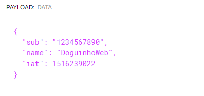

<h1 align="center">
  
</h1>

# Segurança | Semana 14 - Autenticação

Turma Online 22 - B3 | Back-end | Semana 14 | 2023 | Professora Carol Alves (Doguinho :dog:)

# Instruções
Antes de começar, vamos organizar nosso setup.
* Fork esse repositório 
* Faça o clone do repositório forkado na sua máquina (Para isso basta abrir o seu terminal e digitar `git clone url-do-seu-repositorio-forkado`)
* Entre na pasta do seu repositório (Para isso basta abrir o seu terminal e digitar `cd on22-b3-s14-auth-jwt`)
* Abra o VScode (Para isso basta digitar `code .`)

# Resumo

O que veremos na aula de hoje?

* Autenticação
* Criptografia
* Métodos de Autenticação

# Conteúdo da Aula
## Autenticação

1. Motivação
2. Autenticação _vs_ Autorização
## Criptografia

1. Hash (Conceito, vantagens e desvantagens)
2. Criptografia Simétrica (Conceito, vantagens e desvantagens)
3. Criptografia Assimétrica (Conceito, vantagens e desvantagens)
   * Assinaturas
   
## Métodos de Autenticação
1. OAuth (Conceito)
2. JWT (Conceito, estrutura, vulnerabilidades)
   * Implementação

<h1 align="center">
  Autenticação
</h1>

## Segurança da nossa API

Nas aulas anteriores você aprendeu sobre rotas POST, GET, PATCH, PUT e DELETE. Aprendeu também sobre banco de dados e também a utilizar essas rotas para trabalhar com os dados. Entretanto, concorda que qualquer pessoa hoje que tiver acesso a essas rotas que criou poderá utilizá-las livremente para salvar, trazer, alterar e deletar informações sem o menor tipo de controle?

Isso é extremamente perigoso, não somente para a segurança da aplicação em si, mas para todo o negócio! Imagina que você está desenvolvendo um produto para um cliente (que pode ser de qualquer nicho, como por exemplo, financeiro, área médica, educação etc) e os dados dos clientes são vazados ou mesmo alterados na base de dados? É um problema bem grande, certo? Por isso é importante que tenhamos um mínimo (e máximo) de cuidado com a segurança do que desenvolvemos.

## Autorização x Autenticação

A autorização se trata da permissão de acessar determinados recursos baseados em uma autenticação já bem sucedida.
Ou seja, a autenticação é o ato de inserir um e-mail/nome de usuário e senha, onde o sistema reconhece o usuário e aí sim irá autorizar o mesmo a utilizar recursos protegidos de usuários não autenticados.

Então após a autenticação temos o início do fluxo do JWT, que é composto por algumas etapas, vamos conhecê-las???

<h1 align="center">
  Criptografia
</h1>

Quando falamos de criptografar logo pensamos em algo super complexo, mas isso nada mais é do que codificar uma mensagem que você não quer que pessoas não autorizadas tenha acesso.
Um filme bem bacana que fala desse tema e que vale a pena assistir é o Jogo da Imitação, que conta sobre o matemático Alan Turing e a criptoanalista Joan Clarke na Segunda Guerra Mundial, quando desenvolveram uma máquina que foi capaz de descriptografar (revelar) mensagens de comunicação da Alemanha Nazista.
Para armazenar senhas na base de dados, podemos utilizar um código [hash](https://passwordsgenerator.net/sha1-hash-generator/)
## Hash

- Hash é uma string (texto) criptografada e é gerada a partir de uma função de Hash. O hash pode ter diversas utilidades, como por exemplo, armazenar uma senha numa base de dados para uma posterior checagem.
Importante: uma função de hash não tem volta, uma vez que você transforma uma string em um hash, a partir de uma função de hash, não é possível transformar novamente na string original.

Os algoritmos mais conhecidos para hash são: MD5, SHA-1 e SHA-2.

- Vantagem: É uma operação pouco custosa de computação e segura pois é unidirecional, isto é, impossível de você voltar a string original a partir do hash.
- Desvantagem: a principal desvantagem é que não é possível recuperar uma senha; você só pode redefinir sua senh

## Criptografia Simétrica

Os algoritmos de criptografia simétrica utilizam apenas uma chave para criptografar um dado qualquer, que pode ser uma mensagem, etc.
Os algoritmos mais conhecidos são: DES, TripleDES, AES, RC4 e RC5.

- Vantagem: É muito mais rápido, o que traduz em baixa latência e pouco uso de CPU.
- Desvantagem: Devido a utilização da mesma chave para criptografar e descriptografar, a chave precisa ser compartilhada com o receptor.

## Criptografia Assimétrica

Criptografia assimétrica utilizam duas chaves complementares para criptografar e descriptografar. Uma das chaves é guardada em segredo e não é revelada ninguém (chave privada) e outra pode ser publicada a qualquer um livremente (chave pública). 
Os algoritmos mais conhecidos são: RSA e ECDSA.

Vantagem: É um dado criptografado com uma chave que pode apenas ser descriptografado com outra chave e vice-versa. Sendo assim uma comunicação segura, mesmo que o meio de comunicação não seja.
Desvantagem: São muito custosos em termos de CPU, por esse motivo as comunicações, normalmente, os utilizam como meio de troca de chave simétrica. Diminuindo, assim o tempo e recursos da CPU.

## Assinaturas

Um uso comum para a criptografia assimétrica (além de ser utilizada para garantir privacidade) são as assinaturas para garantir identidade.
Quando queremos apenas confirmar identidade o dado não é privado, pois a chave pública está disponível a qualquer um, o que permite que os mesmos acessem os dados. Assim, uma maneira eficiente de alcançar o mesmo objetivo é gerar uma soma Hash (Checksum) dao dado e criptografar esse resultado. Então a confirmação de identidade passaria a ser da seguinte maneira: gerar uma soma Hash do dado recebido, descriptografar a assinatura recebida e por fim comparar se os resultados são iguais.

<h1 align="center">
  Métodos de Autenticação
</h1>

## OAuth
É um mecanismo de autorização utilizado para realizar login por meio de redes sociais (ex: login pelo Facebook, Twitter etc).

## JWT - json web token

Estrutura no formato Json, compacto e seguro, composto por chave/valor. Ele permite as informações sejam assinadas tanto com criptografia simétrica, quanto com criptografia assimétrica.
Envia para o servidor para que ele possa entender e disponibilizar os recursos que estamos querendo acessar.

## O fluxo de autorização com JWT

JSON Web Tokens tem um fluxo simples e que é constituído de algumas etapas, iniciando na autenticação

1. Usuário é autenticado no sistema;
2. É enviado um JSON Web Token para o usuário;
3. A cada requisição o token deve ser enviado também;
4. O token é validado, e se for válido o usuário obtém a resposta protegida por autorização;
5. Os passos 4 e 5 se repetem n vezes, até o usuário para de usar o sistema;

Temos então que o usuário preenche um formulário e realiza o login, como resposta deste processo recebe um token que é o nosso conhecido JSON Web Token, esse deve ser salvo de alguma maneira no computador do usuário

Geralmente é utilizada a localStorage, um recurso de JavaScript
Sempre que houver uma requisição para o servidor, o token deve ser enviado, pois é baseado nele que o servidor avalia se o usuário está autorizado ou não a acessar tal recurso
Ou seja, há uma decodificação do token no back-end, que checa a sua validade
Se positivo, o usuário recebe a resposta do que solicitou, podendo prosseguir na utilização do sistema
E isso acontece em todas as próximas requisições, se necessitarem de alguma informação protegida a validação do token entra em cena e determina o que vai acontecer depois
Note então que passa ser obrigatório o envio do JSON Web Token, pois sem ele não estamos autorizados, o back-end não tem como saber de outra forma que estamos habilitados a acessar informações ‘sensíveis’
Após o destrinchamento do fluxo, temos que entender como é constituído o token
Todo token tem partes que são comuns e também as suas especifidades

## Estrutura do [JWT](https://jwt.io) - JSON Web Token

Aqui é o seu TOKEN:

Agora vamos entender como o [JWT decodifica o token](https://youtu.be/sHyoMWnnLGU?t=672)

HEADER: cabeçalho que define o tipo de algoritmo (a função que irá realizar para codificar/decodificar) e o tipo de token no caso o JWT.

PAYLOAD: são os dados que passamos no JWT entre as nossas requisições, que são gerados no Backend.
- "sub" é o id do usuário;
- "name" nome do usuário;
- "iat" marca a data de criação deste token, geralmente é acompanhado de uma chave chamada "exp" que diz quando irá expirar (encerrando a sessão do usuário);
- podemos passar também o "role" que define o que o usuário pode fazer no sistema. ex: "role" : "admin".

VERIFY SIGNATURE: que é a assinatura, onde temos a validação do token para a aplicação. O nosso SECRET geralmente uma string bem forte como se fosse uma senha (é onde está a maior parte da segurança, por ser única e diferente em cada aplicação)

## Vulnerabilidades

Se a biblioteca aceita que um token seja validado sem especificar o algoritmo esperado, outra vulnerabilidade grave é aberta. Exatamente no caso esperarmos que o token use uma criptografia assimétrica e o atacante utiliza uma criptografia simétrica. O problema com essa lógica é que o atacante pode obter a chave pública e assinar um token qualquer utilizando um algoritmo simétrico (HMAC) e indicar no cabeçalho o mesmo algoritmo. Assim quando um recurso protegido utilizar o mesmo algoritmo e a mesma chave o token será considerado válido, pois a assinatura gerada será igual a assinatura do token.

Lembrando que nesse caso como os tokens válidos estão sendo assinados com a chave privada os mesmos devem ser validados com a chave pública. Por isso o atacante terá sucesso, pois tem a certeza que o token está sendo validado com a chave pública.

## Recomendações

Desenvolvedores deveriam exigir que o algoritmo utilizado para validação seja passado como parâmetro. Assim garante-se que será utilizado o algoritmo apropriado para a chave fornecida. Caso seja necessária a utilização de mais de um algoritmo com chaves diferentes, a solução é atribuir um identificador para cada chave e indicá-la no campo kid do cabeçalho (key identifier, em inglês). Assim será possível inferir o algoritmo de acordo com a chave utilizada. Dessa maneira o campo alg não terá utilidade alguma além de, talvez, validar se ele indica o algoritmo esperado.

Ao utilizar uma implementação do padrão JWT, você deve auditar de maneira consistente se ela rejeita efetivamente algoritmos além do esperado. Assim a possibilidade de sucesso em ataques dessa natureza estarão quase nulos.

***
# Exercícios :pencil:

##  🎓 Para Sala

* Durante a aula de hoje iremos criar uma estrutura modelo para as colaboradoras e criar as rotas para login, dessa forma iremos conseguir cadastrar, buscar, deletar e fazer o login uma colaboradora!
* Ao final da aula, faremos juntas o código para proteger nossa rota da API; dessa forma ao acessar um método ela irá exigir um token de autorização para que a usuária possa acessar.
* Faremos juntas os testes da parte de login de nossas colaboradoras, Bora codar?!

##  🎓 Para Casa

Oie meninas, vamos de tarefinha.

* Para casa vocês deverão proteger as rotas do Projeto Guiado III; conforme fizemos em aula; colocando uma rota para login e protegendo todas as rotas de Consoles e Games exigindo sempre um token de autorização.
* Lembrando: ele está nesse mesmo repositório, não é necessário fazer a atividade no repositório da semana 13 da aula da Professora Gaia!

### Material da aula :books:
- [Slide da Aula](https://www.canva.com/design/DAFfLgCbsiU/sZmAv5l9QhRXEVfV42LCUA/view?utm_content=DAFfLgCbsiU&utm_campaign=designshare&utm_medium=link&utm_source=publishsharelink)
- [Slides da Aula em pdf](https://github.com/reprograma/On22-B3-S14-Auth-JWT/blob/main/material/Slides%20JWT.pdf)

### Leitura Extra Obrigatória :open_book:
- [Código Seguro](https://github.com/reprograma/On22-B3-S14-Auth-JWT/blob/main/material/01.%20C%C3%B3digo%20Seguro.md)

##  Minhas redes sociais
 - [LINKEDIN](https://www.linkedin.com/in/carolalves90/)
 - [GITHUB](https://github.com/Carolalves90)

Desenvolvido com :purple_heart:  

